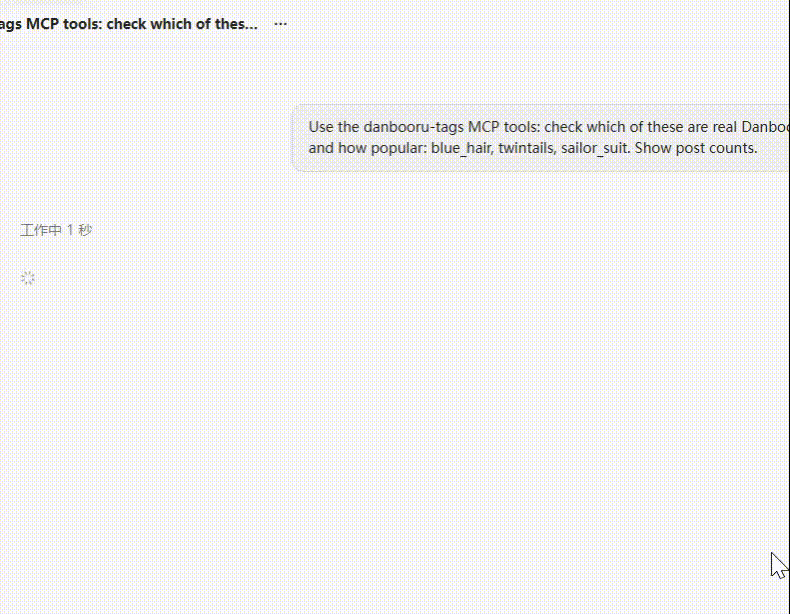

# danbooru-tag-mcp

[](https://github.com/BaixuanZhu/danbooru-tag-mcp/actions/workflows/ci.yml)
[](https://github.com/BaixuanZhu/danbooru-tag-mcp/releases/latest)
[](https://go.dev)
[](LICENSE)

A Danbooru tag lookup [MCP](https://modelcontextprotocol.io) (Model Context
Protocol) server for local AI image generation: your AI client resolves real
Danbooru tags — exact names, aliases, categories, post counts, co-occurrence
statistics, wiki descriptions, and the tag lists of real posts — before
composing prompts, which noticeably improves tag accuracy in generated images.

<p align="center">
  
</p>

## Quick start

Install per-user (Windows 10/11, no admin rights):

```powershell
iwr -useb "https://raw.githubusercontent.com/BaixuanZhu/danbooru-tag-mcp/main/install.ps1" | iex
```

Point your MCP client at the command:

```json
{
  "mcpServers": {
    "danbooru-tags": {
      "command": "danbooru-tag-mcp",
      "args": []
    }
  }
}
```

That's it — the client picks up the seven tools below on its next session.

## Features

- **7 MCP tools**: tag search, exact tag info, related tags, alias resolution, wiki lookup, post search, and tag distribution profiles
- **Tag distribution profiles**: `get_tag_profile` samples a random page of a big tag's posts and answers what it actually renders as — co-occurring tags by in-sample frequency (corpus constants like `1girl`/`solo` split into `ubiquitous`), plus characteristic combinations ranked by lift, so a 300k-post tag like `arm_up` can be checked against what you actually wanted before it pollutes a prompt
- **Tag lists back from post search**: `search_posts` returns each post's full tag list split by category (copyright/artist/character/general/meta), so mining a few posts reveals which tags naturally go together
- **Tagger-era tag detection**: `get_tag_info` classifies every name against the pinned WD14 tagger vocabularies (`wd14` field: `live` / `tagger_era` — a tagger-era name Danbooru has since renamed, try `get_tag_alias` / `unknown`), so LoRA card captions stop dead-ending at "tag not found"; `search_tags` adds `wd14_hits` fallback hits when no result carries posts
- **Uncensored by default**: `search_posts` applies no rating filter — results reflect a tag's whole population (arm_up is ~95% g/s/q); add a `rating:g/s/q/e` metatag when you want only R-18 or only all-ages
- **Self-updating**: `danbooru-tag-mcp upgrade` checks GitHub Releases, verifies SHA256 and replaces the binary atomically
- **Zero-config install**: per-user installer (setup wizard or one-line PowerShell) that registers the install directory into the user PATH automatically
- **Polite API usage**: requests are throttled to one per 1.5 seconds; anonymous access works, credentials raise the limits (free/anonymous post searches are still capped at 2 content tags per query)

## Install

Requires Windows 10/11 on x64 or ARM64.

### Option 1: setup wizard (recommended)

Download `danbooru-tag-mcp-windows-<arch>-setup.exe` from the
[latest release](https://github.com/BaixuanZhu/danbooru-tag-mcp/releases/latest)
and double-click it. This installs per-user to
`%LOCALAPPDATA%\Programs\danbooru-tag-mcp` (no admin rights needed) and
registers the user PATH.

### Option 2: one-line PowerShell

```powershell
iwr -useb "https://raw.githubusercontent.com/BaixuanZhu/danbooru-tag-mcp/main/install.ps1" | iex
```

Custom install directory:

```powershell
.\install.ps1 -InstallDir "D:\tools\danbooru-tag-mcp"
```

### Option 3: portable zip

Download `danbooru-tag-mcp-windows-<arch>.zip` from the
[release page](https://github.com/BaixuanZhu/danbooru-tag-mcp/releases),
extract `danbooru-tag-mcp.exe` anywhere, and run it once — the first run
silently adds its own directory to the user PATH (idempotent).

## Configure your MCP client

Point your MCP client (Claude Desktop, ZCode, etc.) at the command:

```json
{
  "mcpServers": {
    "danbooru-tags": {
      "command": "danbooru-tag-mcp",
      "args": []
    }
  }
}
```

The bare command name works because the install directory is on the user PATH;
alternatively use the full exe path.

## Tools

| Tool | Description | Parameters |
|------|-------------|------------|
| `search_tags` | Search tags by keyword, ordered by post count; when no result has posts, adds `wd14_hits` (WD14 tagger vocab names containing the query) | `query` (required, e.g. `blue hair`), `limit` (default 10) |
| `get_tag_info` | Exact info for one tag (category, post count), plus a `wd14` verdict: `live` (current Danbooru), `tagger_era` (WD14 tagger vocab only, likely renamed — see `get_tag_alias`), `unknown` (neither) | `name` (required, e.g. `blue_hair`) |
| `get_related_tags` | Tags that co-occur with the given tag (meta-category tags like `highres` are filtered out as noise) | `tag` (required), `limit` (default 10) |
| `get_tag_alias` | Resolve an alias or misspelling to its canonical tag (`null` = input is already canonical) | `name` (required, e.g. `sailor_suit`) |
| `get_tag_wiki` | Wiki page of a tag: description, multilingual names, and the `[[tag]]` links extracted from the body | `title` or `other_names` (one required), `limit` (default 5) |
| `search_posts` | Search posts by a tag combination, no rating filter by default (add a `rating:g/s/q/e` metatag to narrow). Each post carries `tags` split by category: `copyright` / `artist` / `character` / `general` / `meta` | `tags` (required, space-separated), `limit` (default 5) |
| `get_tag_profile` | Distribution profile of one tag from a random post sample (default 200 posts, whole population — no rating filter): `co_tags` ordered by in-sample frequency, `ubiquitous` corpus constants (`freq >= 0.5`), `top_pairs` characteristic combinations ranked by lift (co-occurrence above chance). Meta tags and the tag itself excluded | `tag` (required, e.g. `arm_up`), `sample` (default 200, range 20-200) |

## CLI

```
danbooru-tag-mcp            run the MCP server (what MCP clients launch)
danbooru-tag-mcp upgrade    self-update via GitHub Release (SHA256 verified)
danbooru-tag-mcp version    print the version
danbooru-tag-mcp help       show help
```

## Environment variables

- `DANBOORU_LOGIN` — your Danbooru account name (the login you use on the
  site). Optional.
- `DANBOORU_API_KEY` — your Danbooru API key, generated from the API key
  section of your Danbooru profile. Optional. When both `DANBOORU_LOGIN` and
  `DANBOORU_API_KEY` are set, every request is sent authenticated with your
  account (higher rate limits and content access); otherwise the client is
  anonymous and Danbooru applies lower limits.
- `DANBOORU_MCP_NO_BOOTSTRAP` — skip the startup PATH registration when
  non-empty.

## Building from source

Requires Go 1.26+ and GNU Make (bundled with Git Bash):

```bash
make test        # unit tests
make integration # online smoke test against the live Danbooru API (~1 min)
make build       # dev build -> dist/<arch>/ (bootstrap disabled)
make release     # portable zip + checksums.txt
make installer   # NSIS setup exe (requires makensis: scoop install nsis)
```

Releases are automated: pushing a `v*` tag makes GitHub Actions run the test
suite and publish the setup exes, portable zips, and `checksums.txt` for both
architectures.
